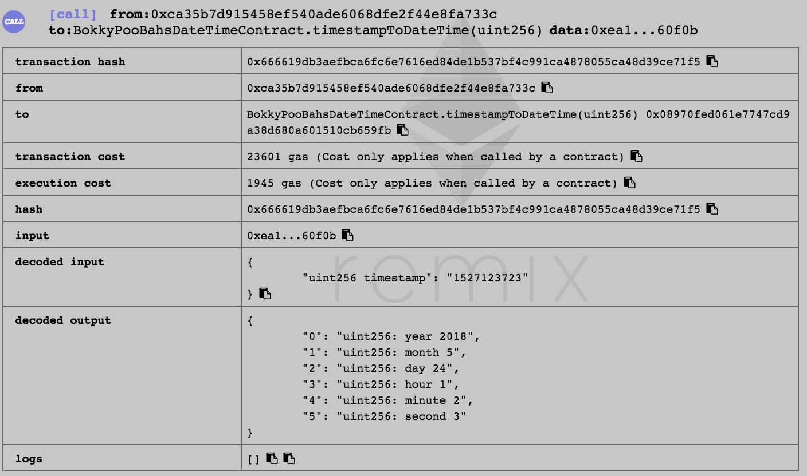
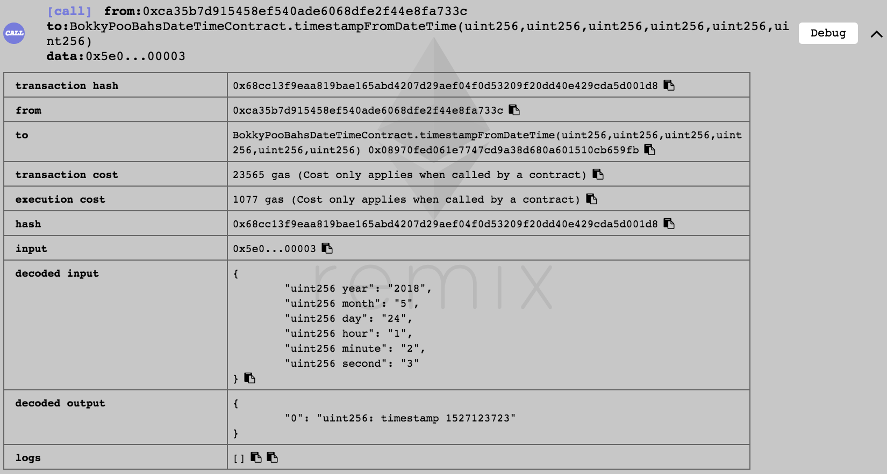

<kbd></kbd>

<br />

<hr />

# BokkyPooBah's DateTime Library

A gas-efficient Solidity date and time library.

Instead of using loops and lookup tables, this date conversions library uses formulae to convert year/month/day hour:minute:second to a Unix timestamp and back.

See [BokkyPooBah’s Gas-Efficient Solidity DateTime Library](https://medium.com/@BokkyPooBah/bokkypoobahs-gas-efficient-solidity-datetime-library-92bf96d9b2da) for more explanations.

Thank you to [Alex Kampa](https://github.com/alex-kampa), [James Zaki](https://github.com/jzaki) and [Adrian Guerrera](https://github.com/apguerrera) for helping to validate this library. Thanks also to [Oleksii Matiiasevych](https://github.com/lastperson) for asking about leap seconds.

<br />

<hr />

## Table Of Contents

* [History](#history)
* [Bug Bounty Scope And Donations](#bug-bounty-scope-and-donations)
* [Deployment](#deployment)
* [Questions And Answers](#questions-and-answers)
* [Conventions](#conventions)
* [Functions](#functions)
  * [_daysFromDate](#_daysfromdate)
  * [_daysToDate](#_daystodate)
  * [timestampFromDate](#timestampfromdate)
  * [timestampFromDateTime](#timestampfromdatetime)
  * [timestampToDate](#timestamptodate)
  * [timestampToDateTime](#timestamptodatetime)
  * [isValidDate](#isvaliddate)
  * [isValidDateTime](#isvaliddatetime)
  * [isLeapYear](#isleapyear)
  * [_isLeapYear](#_isleapyear)
  * [isWeekDay](#isweekday)
  * [isWeekEnd](#isweekend)
  * [getDaysInMonth](#getdaysinmonth)
  * [_getDaysInMonth](#_getdaysinmonth)
  * [getDayOfWeek](#getdayofweek)
  * [getYear](#getyear)
  * [getMonth](#getmonth)
  * [getDay](#getday)
  * [getHour](#gethour)
  * [getMinute](#getminute)
  * [getSecond](#getsecond)
  * [addYears](#addyears)
  * [addMonths](#addmonths)
  * [addDays](#adddays)
  * [addHours](#addhours)
  * [addMinutes](#addminutes)
  * [addSeconds](#addseconds)
  * [subYears](#subyears)
  * [subMonths](#submonths)
  * [subDays](#subdays)
  * [subHours](#subhours)
  * [subMinutes](#subminutes)
  * [subSeconds](#subseconds)
  * [diffYears](#diffyears)
  * [diffMonths](#diffmonths)
  * [diffDays](#diffdays)
  * [diffHours](#diffhours)
  * [diffMinutes](#diffminutes)
  * [diffSeconds](#diffseconds)
* [Gas Cost](#gas-cost)
* [Algorithm](#algorithm)
* [Testing](#testing)
* [References](#references)

<br />

<hr />

## History

Version             | Date         | Notes
:------------------ |:------------ |:---------------------------------------
v1.00-pre-release   | May 25 2018  | "Rarefaction" pre-release. I'm currently trying to get this library audited, so don't use in production mode yet.
v1.00-pre-release-a | Jun 2 2018   | "Rarefaction" pre-release a. Added the [contracts/BokkyPooBahsDateTimeContract.sol](contracts/BokkyPooBahsDateTimeContract.sol) wrapper for convenience.<br />[Alex Kampa](https://github.com/alex-kampa) conducted a range of [tests](https://github.com/alex-kampa/test_BokkyPooBahsDateTimeLibrary) on the library.
v1.00-pre-release-b | Jun 4 2018   | "Rarefaction" pre-release b. Replaced  public function with internal for easier EtherScan verification - [a83e13b](https://github.com/bokkypoobah/BokkyPooBahsDateTimeLibrary/commit/a83e13bef31e8ef399007dd237e42bd5cdf479e6).<br />Deployed [contracts/BokkyPooBahsDateTimeContract.sol](contracts/BokkyPooBahsDateTimeContract.sol) with the inlined [contracts/BokkyPooBahsDateTimeLibrary.sol](contracts/BokkyPooBahsDateTimeLibrary.sol) to the [Ropsten network](deployment/deployment-v1.00-prerelease.md) at address [0x07239bb079094481bfaac91ca842426860021aaa](https://ropsten.etherscan.io/address/0x07239bb079094481bfaac91ca842426860021aaa#code)
v1.00-pre-release-c | June 8 2018  | "Rarefaction" pre-release c. Added `require(year >= 1970)` to `_daysFromDate(...)` in [4002b27](https://github.com/bokkypoobah/BokkyPooBahsDateTimeLibrary/commit/4002b278d1779fcd4f3f4527a60a5887ee6c20ba) as highlighted in [James Zaki](https://github.com/jzaki)'s audit
v1.00-pre-release-d | Sep 1 2018  | "Rarefaction" pre-release d. Added [isValidDate(...)](#isvaliddate) and [isValidDateTime(...)](#isvaliddatetime) in [380061b](https://github.com/bokkypoobah/BokkyPooBahsDateTimeLibrary/commit/380061b9d20c83450ee303f709fe58e973c5f4a9) as highlighted in [Adrian Guerrera](https://github.com/apguerrera)'s audit
v1.00 | Sep 2 2018  | "Rarefaction" release
v1.01 | Feb 14 2019  | "Notoryctes" release. Upgraded contracts to Solidity 0.5.x.<br />Updated to MIT Licence
v1.01 | Feb 17 2019  | Bug bounty added

<br />

<hr />

## Bug Bounty Scope And Donations

Details of the bug bounty program for this project can be found at [BokkyPooBah's Hall Of Fame And Bug Bounties](https://github.com/bokkypoobah/BokkyPooBahsHallOfFameAndBugBounties). Please consider [donating](https://github.com/bokkypoobah/BokkyPooBahsHallOfFameAndBugBounties#donations) to support the bug bounty, and the development and maintenance of decentralised applications.

The scope of the bug bounty for this project follows:

* [contracts/BokkyPooBahsDateTimeLibrary.sol](contracts/BokkyPooBahsDateTimeLibrary.sol)

<br />

<hr />

## Deployment

[v1.00 of the source code](https://github.com/bokkypoobah/BokkyPooBahsDateTimeLibrary/tree/1ea8ef42b3d8db17b910b46e4f8c124b59d77c03/contracts) for [BokkyPooBahsDateTimeContract.sol](https://github.com/bokkypoobah/BokkyPooBahsDateTimeLibrary/blob/1ea8ef42b3d8db17b910b46e4f8c124b59d77c03/contracts/BokkyPooBahsDateTimeContract.sol) and [TestDateTime.sol](https://github.com/bokkypoobah/BokkyPooBahsDateTimeLibrary/blob/1ea8ef42b3d8db17b910b46e4f8c124b59d77c03/contracts/TestDateTime.sol) has been deployed to:

* The Ropsten network:
  * BokkyPooBahsDateTimeContract.sol at [0x947cc35992e6723de50bf704828a01fd2d5d6641](https://ropsten.etherscan.io/address/0x947cc35992e6723de50bf704828a01fd2d5d6641#code)
  * TestDateTime.sol at [0xa068fe3e029a972ecdda2686318806d2b19875d1](https://ropsten.etherscan.io/address/0xa068fe3e029a972ecdda2686318806d2b19875d1#code)

* Mainnet:
  * BokkyPooBahsDateTimeContract.sol at [0x23d23d8f243e57d0b924bff3a3191078af325101](https://etherscan.io/address/0x23d23d8f243e57d0b924bff3a3191078af325101#code)
  * TestDateTime.sol at [0x78f96b2d5f717fa9ad416957b79d825cc4cce69d](https://etherscan.io/address/0x78f96b2d5f717fa9ad416957b79d825cc4cce69d#code)

For each of the deployed contracts above, you can click on the *Read Contract* tab to test out the date/time/timestamp functions.

<br />

<hr />

## Questions And Answers

### Questions by `_dredge`

User [/u/_dredge](https://www.reddit.com/user/_dredge) asked the [following questions](https://www.reddit.com/r/ethereum/comments/8m3p4j/bokkypoobahs_datetime_library_a_solidity/dzkss7n/):

> Some Muslim countries have a Friday/Saturday weekend. Workday(1-7) may be more useful.
>
> I presume leap seconds and such details are taken care of in the Unix timecode.
>
> Some additional ideas for functions below.
>
> Quarter calculations
>
> weekNumber(1-53)
>
> Complete years / months / weeks / days
>
> Nearest years / months / weeks / days

Regarding regions and systems where Friday/Saturday are weekends, please use the function `getDayOfWeek(timestamp)` that returns 1 (= Monday, ..., 7 (= Sunday) to determine whether you should treat a day as a weekday or weekend.

See the next question regarding the leap seconds.

Regarding the additional ideas, thanks!

<br />

### What about the leap second?

Asked by [Oleksii Matiiasevych](https://github.com/lastperson) and */u/_dredge* above.

For example, a [leap second](https://en.wikipedia.org/wiki/Unix_time#Leap_seconds) was inserted on Jan 01 1999.

From the first answer to [Unix time and leap seconds](https://stackoverflow.com/a/16539483):

> The number of seconds per day are fixed with Unix timestamps.
>
> > The Unix time number is zero at the Unix epoch, and increases by exactly 86400 per day since the epoch.
>
> So it cannot represent leap seconds. The OS will slow down the clock to accommodate for this. The leap seconds is simply not existent as far a Unix timestamps are concerned.

And from the second answer to [Unix time and leap seconds](https://stackoverflow.com/a/16539734):

> Unix time is easy to work with, but some timestamps are not real times, and some timestamps are not unique times.
>
> That is, there are some duplicate timestamps representing two different seconds in time, because in unix time the sixtieth second might have to repeat itself (as there can't be a sixty-first second). Theoretically, they could also be gaps in the future because the sixtieth second doesn't have to exist, although no skipping leap seconds have been issued so far.
>
> Rationale for unix time: it's defined so that it's easy to work with. Adding support for leap seconds to the standard libraries is very tricky.
> ...

This library aims to replicate the [Unix time](https://en.wikipedia.org/wiki/Unix_time) functionality and assumes that leap seconds are handled by the underlying operating system.

<br />

### What is the maximum year 2345?

Asked by [Adrian Guerrera](https://github.com/apguerrera).

**2345** is just an arbitrary number chosen for the year limit to test to. The algorithms should still work beyond this date.

<br />

### Why are there no input validations to some of the functions?

Asked by [Adrian Guerrera](https://github.com/apguerrera). Specifically, the functions [_daysFromDate](#_daysfromdate), [timestampFromDate](#timestampfromdate) and [timestampFromDateTime](#timestampfromdatetime).

The date and time inputs should be validated before the values are passed to these functions. The validation functions [isValidDate(...)](#isvaliddate) and [isValidDateTime(...)](#isvaliddatetime) have now been added for this purpose.

<br />

### Why are all variables 256-bit integers?

This library provides a cheap conversion between the timestamp and year/month/day hour:minute:second formats. There is no requirement for this library to store a packed structure to represent a DateTime as this data can be stored as a `uint256` and converted on the fly to year/month/day hour:minute:second.

<br />

### Why do you call this a gas-efficient library?

The formulae for converting between a timestamp and year/month/day hour:minute:second format uses a mathematically simple algorithm without any loops. The gas cost is relatively constant (as there are no loops) and the mathematical computations are relative cheap (compared to using loops and looking up data from storage).

<br />

### Can this library be written more efficiently?

Most likely. The aim of this first version is for the conversions to be computed correctly.

<br />

### How gas-efficient is this library?

From [Gas Cost](#gas-cost), `timestampToDateTime(…)` has an execution gas cost of 3,101 gas, and `timestampFromDateTime(…)` has an execution gas cost of 2,566 gas.

<br />

<hr />

## Conventions

All dates, times and Unix timestamps are [UTC](https://en.wikipedia.org/wiki/Coordinated_Universal_Time).

Unit           | Range                     | Notes
:------------- |:-------------------------:|:---------------------------------------------------------------
timestamp      | >= 0                      | Unix timestamp, number of seconds since 1970/01/01 00:00:00 UTC
year           | 1970 ... 2345             |
month          | 1 ... 12                  |
day            | 1 ... 31                  |
hour           | 0 ... 23                  |
minute         | 0 ... 59                  |
second         | 0 ... 59                  |
dayOfWeek      | 1 ... 7                   | 1 = Monday, ..., 7 = Sunday
year/month/day | 1970/01/01 ... 2345/12/31 |

`_days`, `_months` and `_years` variable names are `_`-prefixed as the non-prefixed versions are reserved words in Solidity.

All functions operate on the `uint` timestamp data type, except for functions prefixed with `_`.

<br />

<hr />

## Functions

### _daysFromDate

Calculate the number of days `_days` from 1970/01/01 to `year`/`month`/`day`.

```javascript
function _daysFromDate(uint year, uint month, uint day) public pure returns (uint _days)
```

**NOTE** This function does not validate the `year`/`month`/`day` input. Use [`isValidDate(...)`](#isvaliddate) to validate the input if necessary.

<br />

### _daysToDate

Calculate `year`/`month`/`day` from the number of days `_days` since 1970/01/01 .

```javascript
function _daysToDate(uint _days) public pure returns (uint year, uint month, uint day)
```

<br />

### timestampFromDate

Calculate the `timestamp` to `year`/`month`/`day`.

```javascript
function timestampFromDate(uint year, uint month, uint day) public pure returns (uint timestamp)
```

**NOTE** This function does not validate the `year`/`month`/`day` input. Use [`isValidDate(...)`](#isvaliddate) to validate the input if necessary.

<br />

### timestampFromDateTime

Calculate the `timestamp` to `year`/`month`/`day` `hour`:`minute`:`second` UTC.

```javascript
function timestampFromDateTime(uint year, uint month, uint day, uint hour, uint minute, uint second) public pure returns (uint timestamp)
```

**NOTE** This function does not validate the `year`/`month`/`day` `hour`:`minute`:`second` input. Use [`isValidDateTime(...)`](#isvaliddatetime) to validate the input if necessary.

<br />

### timestampToDate

Calculate `year`/`month`/`day` from `timestamp`.

```javascript
function timestampToDate(uint timestamp) public pure returns (uint year, uint month, uint day)
```

<br />

### timestampToDateTime

Calculate `year`/`month`/`day` `hour`:`minute`:`second` from `timestamp`.

```javascript
function timestampToDateTime(uint timestamp) public pure returns (uint year, uint month, uint day, uint hour, uint minute, uint second)
```

<br />

### isValidDate

Is the date specified by `year`/`month`/`day` a valid date?

```javascript_
function isValidDate(uint year, uint month, uint day) internal pure returns (bool valid)
```

<br />

<br />

### isValidDateTime

Is the date/time specified by `year`/`month`/`day` `hour`:`minute`:`second` a valid date/time?

```javascript_
function isValidDateTime(uint year, uint month, uint day, uint hour, uint minute, uint second) internal pure returns (bool valid)
```

<br />

### isLeapYear

Is the year specified by `timestamp` a leap year?

```javascript_
function isLeapYear(uint timestamp) public pure returns (bool leapYear)
```

<br />

### _isLeapYear

Is the specified `year` (e.g. 2018) a leap year?

```javascript_
function _isLeapYear(uint year) public pure returns (bool leapYear)
```

<br />

### isWeekDay

Is the day specified by `timestamp` a weekday (Monday, ..., Friday)?

```javascript
function isWeekDay(uint timestamp) public pure returns (bool weekDay)
```

<br />

### isWeekEnd

Is the day specified by `timestamp` a weekend (Saturday, Sunday)?

```javascript
function isWeekEnd(uint timestamp) public pure returns (bool weekEnd)
```

<br />

### getDaysInMonth

Return the day in the month `daysInMonth` for the month specified by `timestamp`.

```javascript
function getDaysInMonth(uint timestamp) public pure returns (uint daysInMonth)
```

<br />

### _getDaysInMonth

Return the day in the month `daysInMonth` (1, ..., 31) for the month specified by the `year`/`month`.

```javascript
function _getDaysInMonth(uint year, uint month) public pure returns (uint daysInMonth)
```

<br />

### getDayOfWeek

Return the day of the week `dayOfWeek` (1 = Monday, ..., 7 = Sunday) for the date specified by `timestamp`.

```javascript
function getDayOfWeek(uint timestamp) public pure returns (uint dayOfWeek)
```

<br />

### getYear

Get the `year` of the date specified by `timestamp`.

```javascript
function getYear(uint timestamp) public pure returns (uint year)
```

<br />

### getMonth

Get the `month` of the date specified by `timestamp`.

```javascript
function getMonth(uint timestamp) public pure returns (uint month)
```

<br />

### getDay

Get the day of the month `day` (1, ..., 31) of the date specified `timestamp`.

```javascript
function getDay(uint timestamp) public pure returns (uint day)
```

<br />

### getHour

Get the `hour` of the date and time specified by `timestamp`.

```javascript
function getHour(uint timestamp) public pure returns (uint hour)
```

<br />

### getMinute

Get the `minute` of the date and time specified by `timestamp`.

```javascript
function getMinute(uint timestamp) public pure returns (uint minute)
```

<br />

### getSecond

Get the `second` of the date and time specified by `timestamp`.

```javascript
function getSecond(uint timestamp) public pure returns (uint second)
```

<br />

### addYears

Add `_years` years to the date and time specified by `timestamp`.

Note that the resulting day of the month will be adjusted if it exceeds the valid number of days in the month. For example, if the original date is 2020/02/29 and an additional year is added to this date, the resulting date will be an invalid date of 2021/02/29. The resulting date is then adjusted to 2021/02/28.

```javascript
function addYears(uint timestamp, uint _years) public pure returns (uint newTimestamp)
```

<br />

### addMonths

Add `_months` months to the date and time specified by `timestamp`.

Note that the resulting day of the month will be adjusted if it exceeds the valid number of days in the month. For example, if the original date is 2019/01/31 and an additional month is added to this date, the resulting date will be an invalid date of 2019/02/31. The resulting date is then adjusted to 2019/02/28.

```javascript
function addMonths(uint timestamp, uint _months) public pure returns (uint newTimestamp)
```

<br />

### addDays

Add `_days` days to the date and time specified by `timestamp`.

```javascript
function addDays(uint timestamp, uint _days) public pure returns (uint newTimestamp)
```

<br />

### addHours

Add `_hours` hours to the date and time specified by `timestamp`.

```javascript
function addHours(uint timestamp, uint _hours) public pure returns (uint newTimestamp)
```

<br />

### addMinutes

Add `_minutes` minutes to the date and time specified by `timestamp`.

```javascript
function addMinutes(uint timestamp, uint _minutes) public pure returns (uint newTimestamp)
```

<br />

### addSeconds

Add `_seconds` seconds to the date and time specified by `timestamp`.

```javascript
function addSeconds(uint timestamp, uint _seconds) public pure returns (uint newTimestamp)
```

<br />

### subYears

Subtract `_years` years from the date and time specified by `timestamp`.

Note that the resulting day of the month will be adjusted if it exceeds the valid number of days in the month. For example, if the original date is 2020/02/29 and a year is subtracted from this date, the resulting date will be an invalid date of 2019/02/29. The resulting date is then adjusted to 2019/02/28.

```javascript
function subYears(uint timestamp, uint _years) public pure returns (uint newTimestamp)
```

<br />

### subMonths

Subtract `_months` months from the date and time specified by `timestamp`.

Note that the resulting day of the month will be adjusted if it exceeds the valid number of days in the month. For example, if the original date is 2019/03/31 and a month is subtracted from this date, the resulting date will be an invalid date of 2019/02/31. The resulting date is then adjusted to 2019/02/28.

```javascript
function subMonths(uint timestamp, uint _months) public pure returns (uint newTimestamp)
```

<br />

### subDays

Subtract `_days` days from the date and time specified by `timestamp`.

```javascript
function subDays(uint timestamp, uint _days) public pure returns (uint newTimestamp)
```

<br />

### subHours

Subtract `_hours` hours from the date and time specified by `timestamp`.

```javascript
function subHours(uint timestamp, uint _hours) public pure returns (uint newTimestamp)
```

<br />

### subMinutes

Subtract `_minutes` minutes from the date and time specified by `timestamp`.

```javascript
function subMinutes(uint timestamp, uint _minutes) public pure returns (uint newTimestamp)
```

<br />

### subSeconds

Subtract `_seconds` seconds from the date and time specified by `timestamp`.

```javascript
function subSeconds(uint timestamp, uint _seconds) public pure returns (uint newTimestamp)
```

<br />

### diffYears

Calculate the number of years between the dates specified by `fromTimeStamp` and `toTimestamp`.

Note that this calculation is computed as `getYear(toTimestamp) - getYear(fromTimestamp)`, rather that subtracting the years (since 1970/01/01) represented by both `{to|from}Timestamp`.

```javascript
function diffYears(uint fromTimestamp, uint toTimestamp) public pure returns (uint _years)
```

<br />

### diffMonths

Calculate the number of months between the dates specified by `fromTimeStamp` and `toTimestamp`.

Note that this calculation is computed as `getYear(toTimestamp) * 12 + getMonth(toTimestamp) - getYear(fromTimestamp) * 12 - getMonth(fromTimestamp)`, rather that subtracting the months (since 1970/01/01) represented by both `{to|from}Timestamp`.

```javascript
function diffMonths(uint fromTimestamp, uint toTimestamp) public pure returns (uint _months)
```

<br />

### diffDays

Calculate the number of days between the dates specified by `fromTimeStamp` and `toTimestamp`.

Note that this calculation is computed as `(toTimestamp - fromTimestamp) / SECONDS_PER_DAY`, rather that subtracting the days (since 1970/01/01) represented by both `{to|from}Timestamp`.

```javascript
function diffDays(uint fromTimestamp, uint toTimestamp) public pure returns (uint _days)
```

<br />

### diffHours

Calculate the number of hours between the dates specified by `fromTimeStamp` and `toTimestamp`.

Note that this calculation is computed as `(toTimestamp - fromTimestamp) / SECONDS_PER_HOUR`, rather that subtracting the hours (since 1970/01/01) represented by both `{to|from}Timestamp`.

```javascript
function diffHours(uint fromTimestamp, uint toTimestamp) public pure returns (uint _hours)
```

<br />

### diffMinutes

Calculate the number of minutes between the dates specified by `fromTimeStamp` and `toTimestamp`.

Note that this calculation is computed as `(toTimestamp - fromTimestamp) / SECONDS_PER_MINUTE`, rather that subtracting the minutes (since 1970/01/01) represented by both `{to|from}Timestamp`.

```javascript
function diffMinutes(uint fromTimestamp, uint toTimestamp) public pure returns (uint _minutes)
```

<br />

### diffSeconds

Calculate the number of seconds between the dates specified by `fromTimeStamp` and `toTimestamp`.

Note that this calculation is computed as `toTimestamp - fromTimestamp`.

```javascript
function diffSeconds(uint fromTimestamp, uint toTimestamp) public pure returns (uint _seconds)
```

<br />

<hr />

## Gas Cost

### `timestampToDateTime(...)` Gas Cost

From executing the following function, the transaction gas cost is 24,693

```javascript
> testDateTime.timestampToDateTime(1527120000)
[2018, 5, 24, 0, 0, 0]
> testDateTime.timestampToDateTime.estimateGas(1527120000)
24693
```

From Remix, the execution gas cost is 3,101 .

From my latest testing with Remix using Solidity 0.4.24:

<kbd></kbd>

<br />

### `timestampFromDateTime(...)` Gas Cost

From executing the following function, the transaction gas cost is 25,054

```javascript
> testDateTime.timestampFromDateTime(2018, 05, 24, 1, 2, 3)
1527123723
> testDateTime.timestampFromDateTime.estimateGas(2018, 05, 24, 1, 2, 3)
25054
```

From Remix, the execution gas cost is 2,566 .

From my latest testing with Remix using Solidity 0.4.24:

<kbd></kbd>

<br />

### Remix Gas Estimates

Remix gas estimates using Solidity 0.4.24:

```json
{
    "Creation": {
        "codeDepositCost": "908400",
        "executionCost": "942",
        "totalCost": "909342"
    },
    "External": {
        "DOW_FRI()": "1130",
        "DOW_MON()": "1262",
        "DOW_SAT()": "1064",
        "DOW_SUN()": "360",
        "DOW_THU()": "1108",
        "DOW_TUE()": "250",
        "DOW_WED()": "778",
        "OFFSET19700101()": "932",
        "SECONDS_PER_DAY()": "690",
        "SECONDS_PER_HOUR()": "580",
        "SECONDS_PER_MINUTE()": "1196",
        "_daysFromDate(uint256,uint256,uint256)": "638",
        "_daysToDate(uint256)": "1280",
        "_getDaysInMonth(uint256,uint256)": "885",
        "_isLeapYear(uint256)": "1115",
        "_now()": "997",
        "_nowDateTime()": "1562",
        "addDays(uint256,uint256)": "772",
        "addHours(uint256,uint256)": "662",
        "addMinutes(uint256,uint256)": "838",
        "addMonths(uint256,uint256)": "1851",
        "addSeconds(uint256,uint256)": "896",
        "addYears(uint256,uint256)": "1846",
        "diffDays(uint256,uint256)": "1207",
        "diffHours(uint256,uint256)": "503",
        "diffMinutes(uint256,uint256)": "316",
        "diffMonths(uint256,uint256)": "infinite",
        "diffSeconds(uint256,uint256)": "712",
        "diffYears(uint256,uint256)": "infinite",
        "getDay(uint256)": "1114",
        "getDayOfWeek(uint256)": "415",
        "getDaysInMonth(uint256)": "1120",
        "getHour(uint256)": "491",
        "getMinute(uint256)": "1373",
        "getMonth(uint256)": "1378",
        "getSecond(uint256)": "810",
        "getYear(uint256)": "1337",
        "isLeapYear(uint256)": "1633",
        "isValidDate(uint256,uint256,uint256)": "942",
        "isValidDateTime(uint256,uint256,uint256,uint256,uint256,uint256)": "1269",
        "isWeekDay(uint256)": "1284",
        "isWeekEnd(uint256)": "624",
        "subDays(uint256,uint256)": "1146",
        "subHours(uint256,uint256)": "288",
        "subMinutes(uint256,uint256)": "992",
        "subMonths(uint256,uint256)": "2363",
        "subSeconds(uint256,uint256)": "1336",
        "subYears(uint256,uint256)": "1871",
        "timestampFromDate(uint256,uint256,uint256)": "718",
        "timestampFromDateTime(uint256,uint256,uint256,uint256,uint256,uint256)": "1077",
        "timestampToDate(uint256)": "infinite",
        "timestampToDateTime(uint256)": "1945"
    }
}
```
<br />

<hr />

## Algorithm

The formulae to convert year/month/day hour:minute:second to a Unix timestamp and back use the algorithms from [Converting Between Julian Dates and Gregorian Calendar Dates](http://aa.usno.navy.mil/faq/docs/JD_Formula.php). These algorithms were originally designed by [Fliegel and van Flandern (1968)](http://www.worldcat.org/title/machine-algorithm-for-processing-calendar-dates/oclc/754110896).

Note that these algorithms depend on negative numbers, so Solidity unsigned integers `uint` are converted to signed integers `int` to compute the date conversions and the results are converted back to `uint` for general use.

<br />

### Converting YYYYMMDD to Unix Timestamp

The Fortran algorithm follows:

```
    INTEGER FUNCTION JD (YEAR,MONTH,DAY)
C
C---COMPUTES THE JULIAN DATE (JD) GIVEN A GREGORIAN CALENDAR
C   DATE (YEAR,MONTH,DAY).
C
    INTEGER YEAR,MONTH,DAY,I,J,K
C
    I= YEAR
    J= MONTH
    K= DAY
C
    JD= K-32075+1461*(I+4800+(J-14)/12)/4+367*(J-2-(J-14)/12*12)
   2    /12-3*((I+4900+(J-14)/12)/100)/4
C
    RETURN
    END
```

Translating this formula, and subtracting an offset (2,440,588) so 1970/01/01 is day 0:

```
days = day
     - 32075
     + 1461 * (year + 4800 + (month - 14) / 12) / 4
     + 367 * (month - 2 - (month - 14) / 12 * 12) / 12
     - 3 * ((year + 4900 + (month - 14) / 12) / 100) / 4
     - offset
```

<br />

### Converting Unix Timestamp To YYYYMMDD

The Fortran algorithm follows:

```
    SUBROUTINE GDATE (JD, YEAR,MONTH,DAY)
C
C---COMPUTES THE GREGORIAN CALENDAR DATE (YEAR,MONTH,DAY)
C   GIVEN THE JULIAN DATE (JD).
C
    INTEGER JD,YEAR,MONTH,DAY,I,J,K
C
    L= JD+68569
    N= 4*L/146097
    L= L-(146097*N+3)/4
    I= 4000*(L+1)/1461001
    L= L-1461*I/4+31
    J= 80*L/2447
    K= L-2447*J/80
    L= J/11
    J= J+2-12*L
    I= 100*(N-49)+I+L
C
    YEAR= I
    MONTH= J
    DAY= K
C
    RETURN
    END
 ```

Translating this formula and adding an offset (2,440,588) so 1970/01/01 is day 0:

```
int L = days + 68569 + offset
int N = 4 * L / 146097
L = L - (146097 * N + 3) / 4
year = 4000 * (L + 1) / 1461001
L = L - 1461 * year / 4 + 31
month = 80 * L / 2447
dd = L - 2447 * month / 80
L = month / 11
month = month + 2 - 12 * L
year = 100 * (N - 49) + year + L
```

<br />

<hr />

## Testing

Details of the testing environment can be found in [test](test).

The DateTime library calculations have been tested for the date range 1970/01/01 to 2345/12/01 for periodically sampled dates.

The following functions were tested using the script [test/01_test1.sh](test/01_test1.sh) with the summary results saved
in [test/test1results.txt](test/test1results.txt) and the detailed output saved in [test/test1output.txt](test/test1output.txt):

* [x] Deploy [contracts/BokkyPooBahsDateTimeLibrary.sol](contracts/BokkyPooBahsDateTimeLibrary.sol) library
* [x] Deploy [contracts/TestDateTime.sol](contracts/TestDateTime.sol) contract
* [x] Test `isValidDate(...)`
* [x] Test `isValidDateTime(...)`
* [x] Test `isLeapYear(...)`
* [x] Test `_isLeapYear(...)`
* [x] Test `isWeekDay(...)`
* [x] Test `isWeekEnd(...)`
* [x] Test `getDaysInMonth(...)`
* [x] Test `_getDaysInMonth(...)`
* [x] Test `getDayOfWeek(...)`
* [x] Test `get{Year|Month|Day|Hour|Minute|Second}(...)`
* [x] Test `add{Years|Months|Days|Hours|Minutes|Seconds}(...)`
* [x] Test `sub{Years|Months|Days|Hours|Minutes|Seconds}(...)`
* [x] Test `diff{Years|Months|Days|Hours|Minutes|Seconds}(...)`
* [x] For a range of Unix timestamps from 1970/01/01 to 2345/12/21
  * [x] Generate the year/month/day hour/minute/second from the Unix timestamp using `timestampToDateTime(...)`
  * [x] Generate the Unix timestamp from the calculated year/month/day hour/minute/second using `timestampFromDateTime(...)`
  * [x] Compare the year/month/day hour/minute/second to the JavaScript *Date* calculation

<br />

<hr />

## References

A copy of the webpage with the algorithm [Converting Between Julian Dates and Gregorian Calendar Dates](http://aa.usno.navy.mil/faq/docs/JD_Formula.php) has been saved to [docs/ConvertingBetweenJulianDatesAndGregorianCalendarDates.pdf](docs/ConvertingBetweenJulianDatesAndGregorianCalendarDates.pdf) as some people have had difficulty accessing this page.

<br />

<br />

Enjoy!

(c) BokkyPooBah / Bok Consulting Pty Ltd - Feb 17 2019. The MIT Licence.
